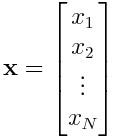
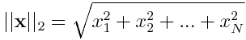
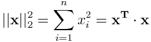

# RegressionAnalysis-ListOfExamples
Intro to Machine Learning and Optimization. COMPENDIUM of the different types of regression techniques used in Machine Learning and Optimization as well as guidance to what libraries can be used in Python.

## What is Regression Analysis?
Regression analysis is a form of predictive modelling technique which investigates the relationship among variables. 

A regression model relates **𝑌** to **𝑋** and **Β**

**𝑌** ≈ 𝑓(**𝑋**,**Β**) 

where depending on the field:  
- **𝑋** is known as the **independent variable**, predictor variable, regressor, covariate, controlled variable, manipulated variable, explanatory variable, exposure variable, risk factor, feature, or input variable.
- **𝑌** is known as the **dependent variable**, response variable, regressand, criterion, predicted variable, target variable, measured variable, explained variable, experimental variable, responding variable, outcome variable, label, or output variable.
- **Β** are the unknown parameters.

If **𝑌** ≈ 𝑓(**𝑋**,**Β**) = **𝑋⋅Β** we say the regression is linear otherwise it remains non-linear. If **𝑌** and **Β** are matrices then we call the regression multivariate. If **𝑌** and **Β** are one dimensional vectors, i.e.,  **𝐲** and **𝛃**, then the regression is univariate and this is generally assumed unless multivariate is specified.

### Notation
To distinct vectors from matrices we will denote vectors in lower-case bold, i.e.,

and matrices in upper-case bold. The transpose of a vector or matrix is indicated by a superscript **𝑇**, i.e., **𝐱****𝑇** is the transpose of **𝐱**. 
The notation ||**𝐱**||2 refers to the Euclidean length of vector **𝐱**, i.e,

The sum of squares of **𝐱** is denoted by ||**𝐱**||22, i.e.,

The 'energy' of a vector **𝐱** refers to ||**𝐱**||22.

In these notes, it is assumed that all vectors and matrices are real-valued. In the complex-valued case, the conjugate transpose should be used in place of the transpose, etc.

## Links to Regression Examples
- Linear (Univariate) Regressions **𝐲** = **𝑋⋅𝛃**
    - [Simple and Multiple linear regression](./Simple_And_Multiple_Linear_Regression)
    - [Polynomial Regression](./Polynomial_Regression)  
    - Ridge Regression
    - Lasso Regression
    - ElasticNet Regression
    - [Logistic Regression](./Logistic_Regression)

## Essential Libraries for Machine Learning in Python
The following is a summary of libraries that will be used throughout the REPO. 

- **Scikit-learn** is one the most popular libraries for working with classical ML algorithms. It builds on three basic libraries of Python: NumPy, SciPy, and Matplotlib.  It supports many supervised and unsupervised learning algorithms. With Scikit-learn you can peform classification, regression, clustering, dimensionality reduction, model selection, or feature extraction.

- **Pandas** is a very popular library used for data extraction. Pandas can easily fetch data from different sources like SQL databases, CSV, Excel, JSON files and manipulate the data into high-level data structures which are simple to use as well as intuitive.

- **Matplotlib** for data visualization is a standard Python library used by every data scientist. In addition, Matplotlib allows to export to common graphic formats like PDF, SVG, JPG, PNG, BMP, GIF, etc.

As an editor I recommend using [JupyterLab](https://jupyterlab.readthedocs.io/en/stable/getting_started/overview.html#) since all examples are saved as .ipynb file extensions.

NOTE: For pure ML operations, Scikit-learn is a more-than-sufficient tool to work with until you start implementing more complex algorithms. (Tensorflow, Pytorch, or Caffe for Deep Learning).

## Bibliography
- https://www.analyticsvidhya.com/blog/2015/08/comprehensive-guide-regression/
- https://medium.freecodecamp.org/essential-libraries-for-machine-learning-in-python-82a9ada57aeb
- https://scikit-learn.org/stable/modules/linear_model.html
- https://www.datascience.com/blog/7-methods-to-fit-linear-model-python
- http://eeweb.poly.edu/iselesni/lecture_notes/least_squares/least_squares_SP.pdf
- https://github.com/sdrangan/introml