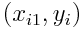
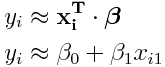
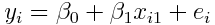
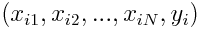
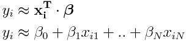
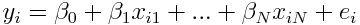
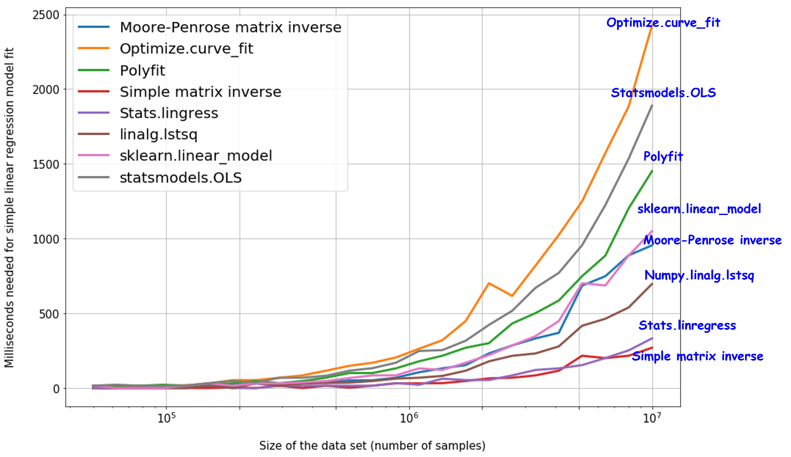

# Simple and Multiple Linear Regression

Hit the star on the top if you like this REPO.

This REPO includes simple and multiple linear regression examples with diffrent method solutions.

| Dimension        | Python Notebook Examples | Solution Method |
| --- | --- | --- |
| 2-D Line Fit   | [Boston House Simple Linear Regression]() | Statistical |
| 3-D Plane Fit  |[Boston House Multiple Linear Regression]() | Simple Matrix Multiplication using Least Squares
| N-D Linear Fit | [Robot Calibration Multiple Linear Regression]() | Scikit-learn's Library

The objective of this Linear (Univariate) Regression **𝐲** ≈ **𝐗⋅𝛃** is to find the best fit by finding parameter vector **𝛃**. 

SUGESTION: Take a quick look at the [Math Notation](./..) being used in this REPO.

## What is Simple and Multiple Linear Regression ?

**Simple Linear Regression** has just one independent variable, i.e, every cordinate pair 𝑖 is written as

where every scalar coordinate 𝑦i relates <u>approximately</u> to a vector **𝐱i** and  a fixed vector of coefficients **𝛃** such that

The complete relationship requires an adjustment error variable 𝑒, i.e., 

it is implied that scalar 𝑥i0 = 1 in vector **𝐱i**

 

**Multiple Linear Regression** has more than one independent variable, i.e, every cordinate tuple 𝑖 is written as

where every scalar coordinate 𝑦i relates <u>approximately</u> to a vector **𝐱i** and  a fixed vector of coefficients **𝛃** such that

The complete relationship requires an adjustment error variable 𝑒, i.e., 

it is implied that scalar 𝑥i0 = 1 in vector **𝐱i**

## Python Packages for Linear Regression
Which one is the best and fastest Python package for simple and multiple linear regression? [Tirthajyoti Sarkar [4]](https://www.datascience.com/blog/7-methods-to-fit-linear-model-python) did the research for us for simple linear regresion.

There are many packages but surprisingly for simple linear regression, the simple least squares (simple matrix inverse) solution works pretty fast compared to scikit-learn’s widely used Linear Model.

For multiple linear regression the research battle will be pending for now.

## What is Least Squares ?

Is a **method** to solve <u>approximately</u> a set of linear equations. We deal with the easy case where the system matrix **𝐗** is full rank. If the system matrix is rank deficient, then other methods are needed, e.g., QR decomposition, singular value decomposition, etc. [[5]](http://eeweb.poly.edu/iselesni/lecture_notes/least_squares/least_squares_SP.pdf)

If **𝐗** is a tall matrix: more rows than columns with linearly independent columns, then the system  

Simple and Multiple Linear Regression are very sensitive to Outliers.
Multiple regression suffers from multicollinearity, autocorrelation, heteroskedasticity.
Multicollinearity can increase the variance of the coefficient estimates and make the estimates very sensitive to minor changes in the model. The result is that the coefficient estimates are unstable
In case we want to reduce the number of independent variables, we can go with forward selection, backward elimination, and step wise approach for selecting only most significant independent variables.